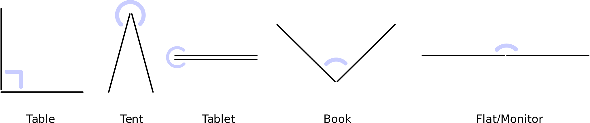
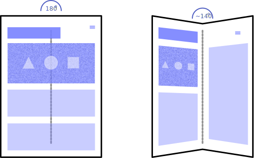
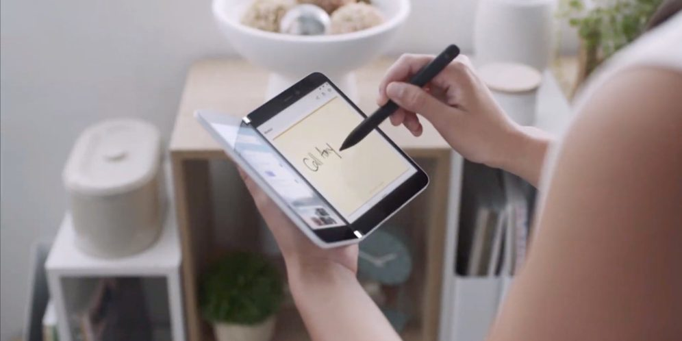
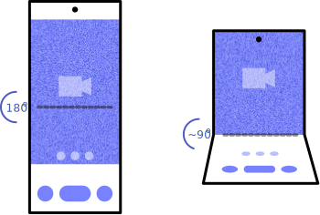
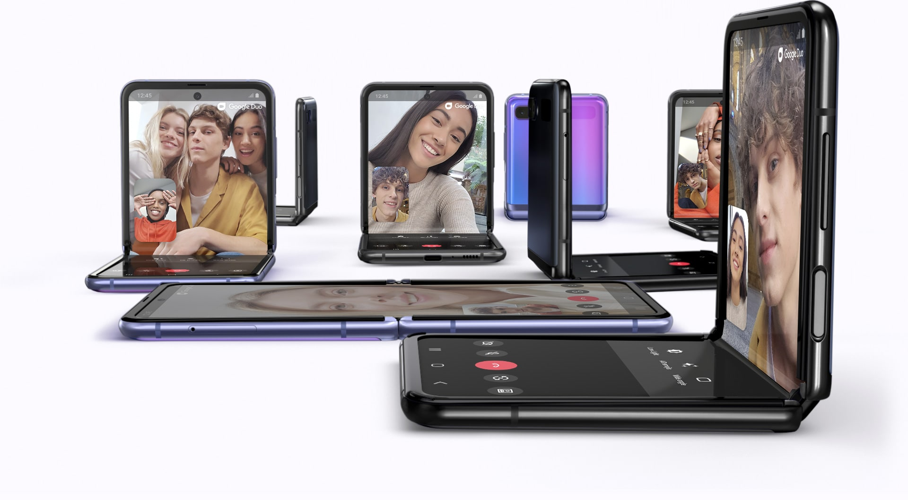
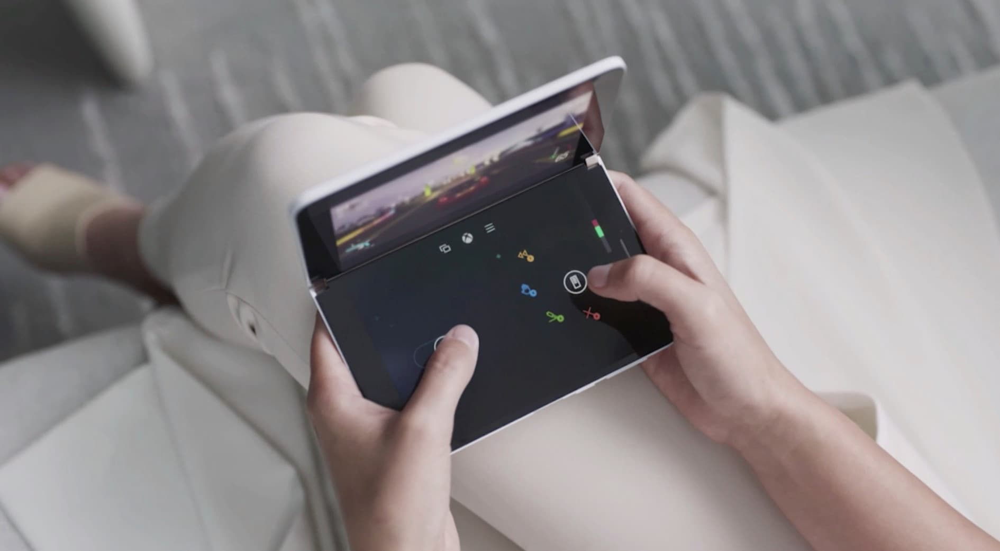
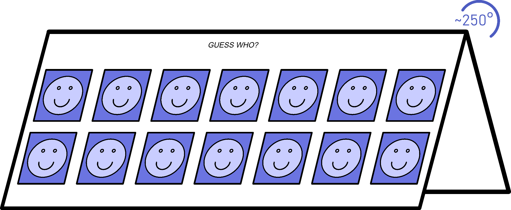
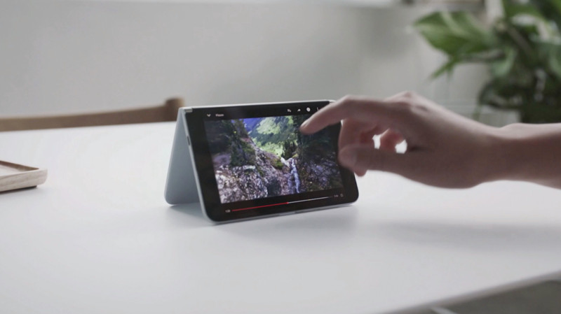
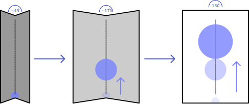

# Fold Angle Explainer

## Authors
* [Diego González-Zúñiga](https://twitter.com/diekus) ([Samsung](https://samsunginter.net))
* [Kenneth Rohde Christiansen](https://twitter.com/kennethrohde) ([Intel](https://intel.com))

## Participate
* [Explainer on GitHub](https://github.com/SamsungInternet/Explainers/blob/master/Foldables/FoldState.md)

## Introduction

New types of mobile devices are appearing that have some sort of folding capabilities around the screen. Among these devices, there are those referred to as “seamless” (like the [Samsung Galaxy Fold](https://www.samsung.com/uk/smartphones/galaxy-fold/), [Samsung Galaxy Flip Z](https://www.samsung.com/uk/smartphones/galaxy-z-flip/), Huawei Mate X, Motorola Razr, Lenovo ThinkPad X1 Fold), and devices “with seam”, which implies they have two (or more) physical screens (like the Microsoft Surface Duo, ZTE Axon M, Surface Neo and Dell Duet). 

While the technology that allows some of these devices is quite new, there is a resurfacing of a trend started by ultrabooks and 2 in 1’s which have had different operating “modes” or postures depending on the hinge (we will use the word fold from now on interchangeably) angle. To note a few, “book”, “tent” an “tablet” modes were available on some devices.

## Goals

Foldable devices come in many shapes and sizes. While the use cases for the ultrabooks of the past vary significantly from those of the new trend of mobile devices due to the inherent focus on screen real estate, **the data in question is similar since it’s related to the angle of the fold**.

The **main interest in knowing the fold angle is because there are interesting opportunities in the area of responsive design that enable new user experiences**. With these new devices, the user can choose to consume content and browse the web even when the device is not flat, in which case the developer might want to provide a different layout for the content depending on the state of the angle of the fold. We propose a way to expose information about the fold angle of the device to the developer. Additionally, developers would like to adopt content depending on the various modes and potentially also animate some of these transitions.

### Expose the value of the angle a screen is folded

#### Pros
* Provide a 360° range on which a web developer can tailor an experience.
* Useful for developers to specify media queries based on specify angle ranges.
* Could be used similar to how native apps are taking advantage of knowing the angle a phone is in to provide better UX. This should be always progressive enhancement and only active if a device supports it.

#### Cons
* The fold angle is not enough to detect whether the device is used in something like a book mode or as a notebook. This can be detected by also relying on other sensors like Gyroscope.
  * Alternatively, when used in conjunction with the Web Platform Primitives for Enlightened Experiences on Foldables CSS ‘spanning’ media feature could allow to detect this setting.
* Leaving the values for the different modes up to app developers will mean that was one site considers one mode, might be considered another on a different site which can be confusing to users.

### Expose postures that enable different layouts

Event that exposes the transitions between modes such as “book”, “laptop”, “notebook”, “tablet”, “stand”, “tent” etc.



#### Pros
* Doesn’t expose exact angle information which could represent a security issue.
  * Can be mitigated by fuzzing out the angle values. (See Privacy and Security)
* Useful for creating web apps that don't need exact angle values to adapt their layouts.  

#### Cons
* The existence of pre-defined modes ties the implementation to specific hardware.
* Not all hardware can support every mode.
* Can’t specify a range of values for the angle.
* Not suited to be used in animations since there is no value exposed.
* Not future-proof, since it assumes the type of folding a device will support.

## Key Scenarios

### Scenario 1: Using it like a book! (~130° / ~170°)

The device displays the web content normally when flat (180°), presenting itself as specified by media queries. When the user folds the device to a specific angle, the layout changes to accommodate a book-like experience where content can avoid the folding area of the device. Once the device goes flat again the content flows according to the available screen size.

Notice that this mode doesn’t entirely depend on the fold angle but also the orientation of the device. For example, this use case can be achieved by combining it with the spanning css media query and orientation proposed in the [Web Platform Primitives for Enlightened Experiences on Foldable Devices](https://github.com/MicrosoftEdge/MSEdgeExplainers/blob/master/Foldables/explainer.md#the-spanning-css-media-feature).



This mode can be interesting for blogs, online magazines or developers that want to mimic an open book layout. As an example, Microsoft teases the use of the Surface Duo like a book in many scenarios (see image below).



### Scenario 2: Put it on a table! (~90° / ~120°)

The user can fold the device in a the device on a surface (table for example) and use the device while folded in between a specified range.



Examples of uses can include:

* Conferencing calls (sharing screen or video)
* Streaming media, like TV shows as well as video streams
* Games (multiplayer battleship-like, board games, chess, cards)
* Productivity Apps
* Galleries, Video players

As an example of this, we can see Samsung/Google's implementation of apps like Duo on the Galaxy Flip Z. The controls remain on the bottom part of the UI while the video itself is on the top. Notice on the flat phone in the image how the app is displayed “normally” or by default when the angle is 180°.



Another example is a gaming scenario where the bottom part of the screen (or bottom-screen) can be used for controls. Microsoft teases this type of functionality by showing some sort of controls for a game on the Surface Duo, when the device is around 90°.



### Scenario 3: Kinda like a tent! (~250° / ~300°)

For devices that support it (devices that can fold on their back like the Surface Duo, or the Huawei Mate X that has the screen on the outer part of the device) having the option of passing content to either side of the fold, or accomodate content to create split screen games or similar can be beneficial. (think of a web based “Guess who” or battleship like game on one device) can be implemented by detecting how open the fold is).



Another useful layout can be optimizing for video playback, as this example from using a Surface Duo to view a video.



### Scenario 4: “GUI based on Angle value” (opening/closing the device)

The developer can enable the GUI on the web application to react to values from the angle the device is on. On the diagram below we envision a website in which it’s background changes lightness, and a sphere changes size and position based on how open the device is. 



Examples:

* Animate background of a page to change when the user is folding the device. Can have different hues/saturation based on the angle value.
* Animate objects in a page to react to the opening/closing of the device. Think of a canvas element in a page with an initial composition of mountains at night. When the user starts opening the device the sun can rise accordingly and the composition depicts noon when the device is completely open.
  * As an example, think of an animation like [this one](https://youtu.be/x1Lnq9eG0IQ?t=560) but controlled by the state of the opening of the device.
* Another use case for animations could be in transitions when rearranging the layout of a UI in combination with CSS Grid. You can see an example [here](https://css-irl.info/animating-css-grid/). 

## 

## Proposals

### New CSS media queries: `min-angle` `max-angle` 

In order to cater to foldable devices, we propose the addition of 2 new media queries `min-angle` and `max-angle` which values can take an angle from the CSS data type.

#### Examples

```css
@media(min-angle: 110deg) { ... }

@media(max-angle: 170deg) and (spanning: single-fold-vertical) { ... }
```

### New CSS media query: `screen-fold-posture`

We also propose a media query that would resolve to a set of fixed postures. These postures consist of a number of predefined values that each encompass a range of angles.

Among the values that the screen-posture query can take are:
* Laptop
* Tent
* Tablet
* Book
* Flat

#### Examples

```css
@media (screen-fold-posture: laptop) { ... }

/*for a monitor scenario*/
@media (screen-fold-posture: flat) and (orientation: portrait) { ... }
```

### New CSS environmental variable: screen-fold-angle

We also propose the addition of a new environmental variable, ‘screen-fold-angle’, which contains the value of the angle on which the screen is folded. The value of this environmental variable is of the CSS angle data type.

```css
env(screen-fold-angle);
```

### New JS object in `window.screen`: `ScreenFold`

The Window property screen returns a reference to the screen object associated with the window. It already houses a similar property [`orientation`](https://developer.mozilla.org/en-US/docs/Web/API/ScreenOrientation) that itself has a value for an [angle](https://w3c.github.io/screen-orientation/#idl-index).

#### Proposed Object
```javascript
ScreenFold : EventTarget {
  readonly attribute unsigned short angle;
  readonly attribute ScreenFoldMode mode;
  attribute EventHandler onchange;
}

enum ScreenFoldMode {
  "laptop",
  “...”,
}
```

## Considered Alternatives

### Angle Sensor based on `GenericSensor` API

A [Generic Sensor](https://www.w3.org/TR/generic-sensor/) like FoldAngleSensor that exposes the value of hinge angle was considered.

 We think the inclussion of a new object to the `window.screen` interface (as defined earlier) feels more coherent with the current web platform architecture. 


## Privacy and Security

Exposing the screen fold angle can have some privacy implications when it comes to privacy and security. Specifically, the angle value could be used for browser fingerprinting, in a way that can help fully or partially identify individual users. There are two ways that we think this can be mitigated, described below. 

### Lowering the resolution of the angle value
 
 We think that lowering the resolution of the angle can lead to reducing the uniqueness that the value can have. Nonetheless, if several sites are being displayed on the same device, it can be easy to identify that it is the same user, even if the value is rounded. As a solution, we also propose applying some fuzziness to the value itself.

### Applying fuzziness to the angle value 

Lowering the resolution of the returned value may not be enough, so fuzzing out the value can algo help, in order to report different values. This fuzzy offset can help differentiate returned values, minimizing the risk of fingerprinting.

### Proposed privacy solutions per use case

#### Scenario 1, 2, 3: Use it like a book, Put it on a table, Kinda like a tent

The first three scenarios described earlier can be achieved by either using the angle values with the min-angle/max-angle or the postures media query. For these cases, the resolution and fuzziness of the returned angle value are not important since they will trigger a layout/style change based on defined values. Precision is not important here, since a few degrees wont be perceivable by the user.

#### Scenario 4: Animations

For scenario 4, dealing with animations, the lower resolution might have an impact on the smoothness of the animation itself. We would have to explore more in depth with the results of animating controlled by the fold, since the animation itself would be linked to a physical action in the device which could go unnoticed.  

## Complementary proposals
* [Web Platform Primitives for Enlightened Experiences on Foldable Devices](https://github.com/MicrosoftEdge/MSEdgeExplainers/blob/master/Foldables/explainer.md)

## Other related technologies
Google has recently unveiled the second Android Developer Preview for version 11 which includes a reference to "[Hinge Angle for Foldables](https://android-developers.googleblog.com/2020/03/android-11-developer-preview-2.html)", which should make exposing this value to the browser easier.  

## Stakeholder Feedback
No stakeholder feedback has been given at this time.

## References & Acknowledgements
Many thanks for valuable feedback and advice from:
* [Daniel Appelquist](https://twitter.com/torgo), [Samsung](https://samsunginter.net) 
* [Alexis Menard](https://twitter.com/darktears), [Intel](https://intel.com) 
* [Jo Balletti](https://twitter.com/thisisjofrank), [Ably Realtime](https://ably.io)
* [Michael Blix](https://twitter.com/mkeblx), [Samsung](https://samsunginter.net) 
